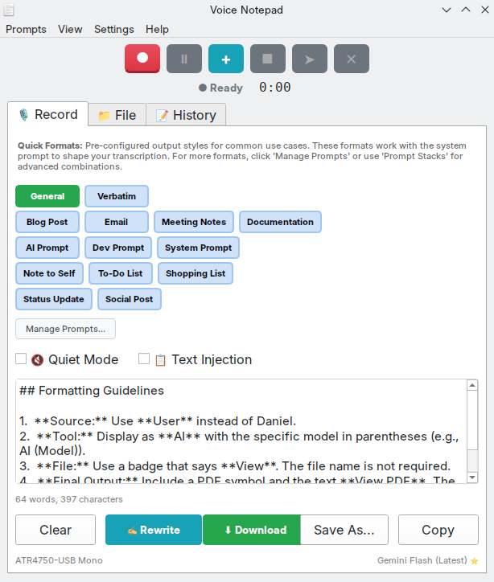
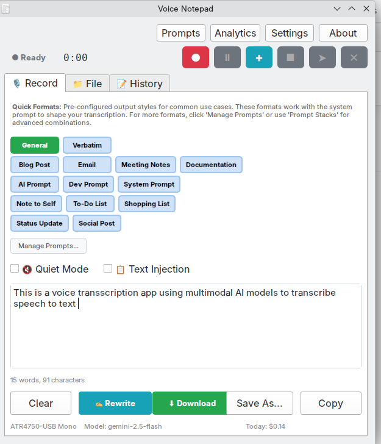
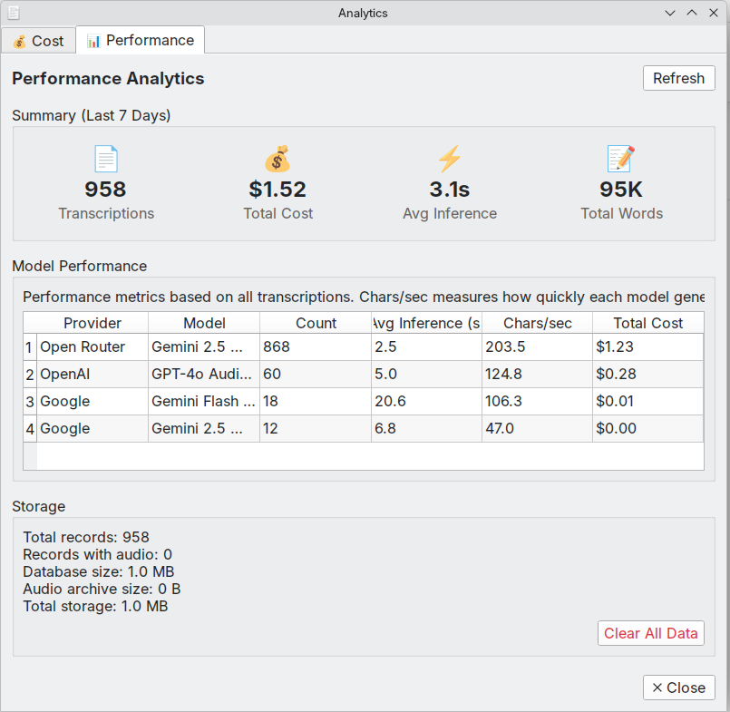
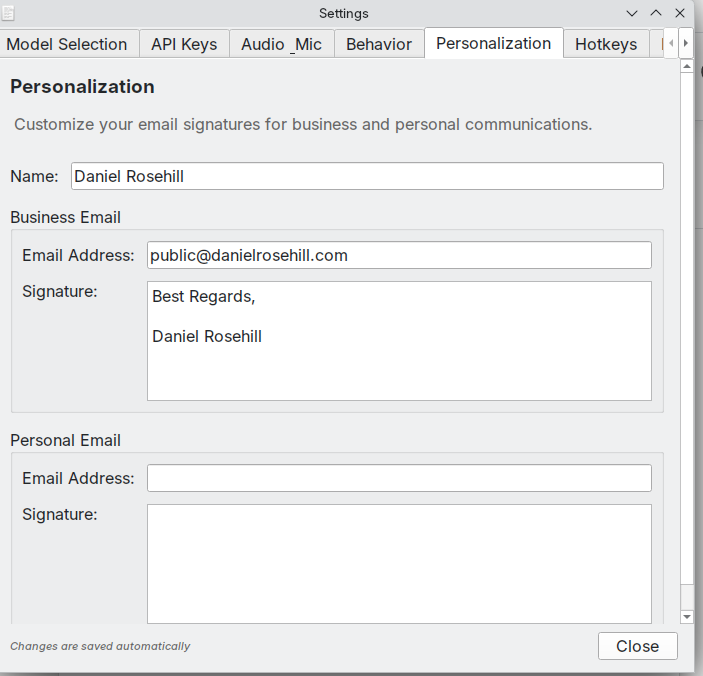
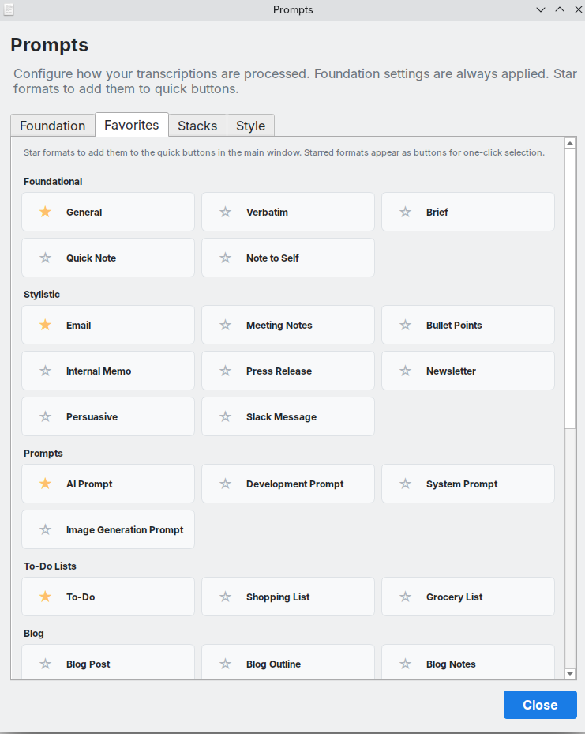
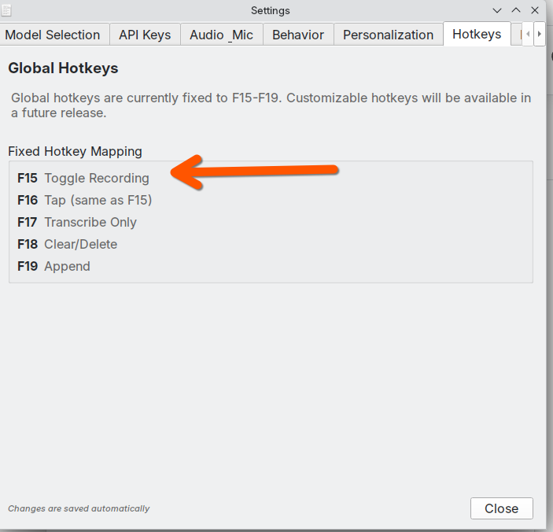
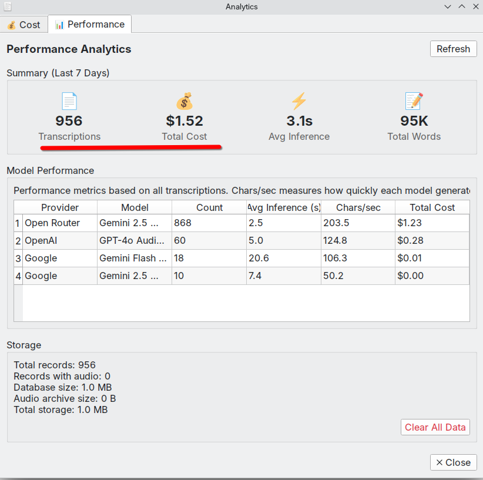

# AI Transcription Notepad - Multimodal Cloud API Text Transcription/Dictation App  




**Download:** [GitHub Releases](https://github.com/danielrosehill/Voice-Notepad/releases) (AppImage, Windows Installer, Debian .deb, Tarball)

Over the past year, I've been using AI extensively for speech-to-text tasks, specifically by combining ASR models like Whisper for transcription with LLMs like GPT-4 for rewriting / transcript post-processing.

This transcription utility has takes a different approach by using an audio multimodal model for single-pass text transcription and cleanup (the default model is Gemini Flash 2.5 although in theory any multimodal model with audio understanding and which can process audio and text tokens simultaneously would be suitable).

 During the first fortnight of using this app I've validated it to be both highly effective and cost-efficient: API costs of just a few dollars for almost 1,000 very useful transcriptions!

Gemini is available through the Google Gemini API (recommended for the dynamic `gemini-flash-latest` endpoint) or via OpenRouter.


## How It Works

Most voice-to-text apps use a two-step process: first transcribe with ASR, then clean up with an LLM. AI Transcription Notepad sends your audio directly to multimodal AI models that can hear and transcribe in a single pass.

This matters because the AI "hears" your tone, pauses, and emphasis rather than just processing raw text. Verbal editing works naturally: say "scratch that" or "new paragraph" and the model understands. You also get faster turnaround and lower cost with one API call instead of two.

## Supported Providers

**Google Gemini** (recommended) offers direct access to Gemini models including the dynamic `gemini-flash-latest` endpoint. This endpoint always points to Google's latest Flash model, eliminating the need for manual updates when new versions are released. Available models: Gemini Flash Latest, Gemini 2.5 Flash, Gemini 2.5 Flash Lite, and Gemini 2.5 Pro.

**OpenRouter** provides access to Gemini models through an OpenAI-compatible API with accurate per-key cost tracking. Note: The dynamic `gemini-flash-latest` endpoint is not available through OpenRouter.

## Features

AI Transcription Notepad records audio and sends it directly to multimodal models with a cleanup prompt. No separate ASR step is required. You can record with your microphone or upload audio files (MP3, WAV, OGG, M4A, FLAC).

Global hotkeys let you record from anywhere, even when the app is minimized. Voice Activity Detection strips silence before upload to reduce costs, and Automatic Gain Control normalizes audio levels for consistent results.

### Database & Storage

All transcriptions are saved to a **MongoDB-compatible database** (using Mongita, a pure Python MongoDB implementation). This provides flexible document storage with full-text search capabilities. Data is stored locally at `~/.config/voice-notepad-v3/mongita/`.

The Cost tab monitors API spend, with OpenRouter showing actual key-specific costs. The Analysis tab compares model performance and inference times.

### Prompt Management

**Prompt Stacks** let you layer multiple AI instructions for complex transcription scenarios. Create and save reusable prompt combinations that stack together with the base cleanup prompt. Perfect for specialized workflows like meeting notes with action items, technical documentation with code extraction, or multi-language transcription with translation.

Cleanup prompts are customizable with format presets for email, todo lists, meeting notes, blog posts, and documentation. Audio archival saves recordings in Opus format at about 24kbps.

**Email Personalization** allows you to configure separate business and personal email addresses with custom signatures (Settings → Personalization). When generating emails, the app automatically injects the appropriate signature via prompt injection, eliminating manual signature entry and ensuring consistent professional formatting.

See [docs/](docs/) for detailed documentation.

## Screenshots (V 1.8.1)

### Main Interface

The main window with Quick Formats for one-click transcription styles. Select your format, record, and get clean, formatted text.



> **Version 1.8.1** · December 2025

---

### Performance Analytics

Track transcription counts, costs, inference times, and total words. Compare model performance across providers.



> **Version 1.8.1** · December 2025

---

### Email Personalization

Configure separate business and personal email signatures. The AI automatically injects the appropriate signature when generating emails.



> **Version 1.8.1** · December 2025

---

### Prompt Formats

Star your favorite formats for quick access. Choose from foundational styles, email templates, meeting notes, to-do lists, and specialized prompts.



> **Version 1.8.1** · December 2025

---

### Global Hotkeys

System-wide hotkeys (F15-F19) work even when the app is minimized. Toggle recording, transcribe, append, or clear with a single key press.



> **Version 1.8.1** · December 2025

---


## Cost



Multimodal transcription is extraordinarily cost-effective. Real usage data from AI Transcription Notepad using Gemini 2.5 Flash:

- **848 transcriptions** for **$1.17 total**
- **84,000 words** transcribed and cleaned
- About **$0.014 per 1,000 words** (1.4 cents)

This includes the full cleanup prompt that handles formatting, punctuation, filler word removal, and more.


## Installation

Download from [Releases](https://github.com/danielrosehill/Voice-Notepad/releases).

On Linux, choose AppImage (universal), .deb (Debian/Ubuntu), or tarball (portable). On Windows, choose the installer (.exe) or portable .zip.

Windows may show a SmartScreen warning for unsigned software. Click "More info" then "Run anyway" to proceed. Verify downloads with the SHA256 checksums in the release.

To run from source:

```bash
git clone https://github.com/danielrosehill/Voice-Notepad.git
cd Voice-Notepad
./run.sh
```

The script creates a virtual environment using `uv` (fast Python package manager) and installs dependencies automatically.

**Note:** Requires `uv` to be installed. Install with:
```bash
curl -LsSf https://astral.sh/uv/install.sh | sh
```

### Development

Run from source:

```bash
./run.sh           # Run from source without installing
```

Build and install locally:

```bash
./build.sh --dev   # Fast build + install (no compression)
```

Create a release:

```bash
./build.sh --release        # Bump version + build all formats
./build.sh --release-deb    # Bump version + build .deb only
```

Run `./build.sh` with no arguments to see all available commands.

**Branching:** `main` is always stable. New features are developed on `feature/*` branches and merged to main when ready. No development releases are published—only stable releases from main.

## Configuration

Add your API key via Settings in the app, or set environment variables:

```bash
GEMINI_API_KEY=your_key      # Recommended - supports gemini-flash-latest
OPENROUTER_API_KEY=your_key  # Alternative - access via OpenAI-compatible API
```

## Quick Start

1. Select your microphone and AI provider
2. Press Record (or Ctrl+R, or your global hotkey)
3. Speak naturally, including instructions like "new paragraph" or "scratch that"
4. Press Stop & Transcribe (Ctrl+Return)
5. Copy or save your cleaned transcript

## Documentation

- [docs/](docs/) - Full documentation
- [User Manual v2 (PDF)](docs/manuals/Voice-Notepad-User-Manual-v2.pdf) - Complete guide (v1.8.0)
- [User Manual v1 (PDF)](docs/manuals/archive/Voice-Notepad-User-Manual-v1.pdf) - Legacy guide (v1.3.0)
- [changelog.md](changelog.md) - Version history

## Related

- [Audio-Multimodal-AI-Resources](https://github.com/danielrosehill/Audio-Multimodal-AI-Resources) - Curated list of audio-capable multimodal AI models
- [Audio-Understanding-Test-Prompts](https://github.com/danielrosehill/Audio-Understanding-Test-Prompts) - Test prompts for evaluating audio understanding

## License

MIT
