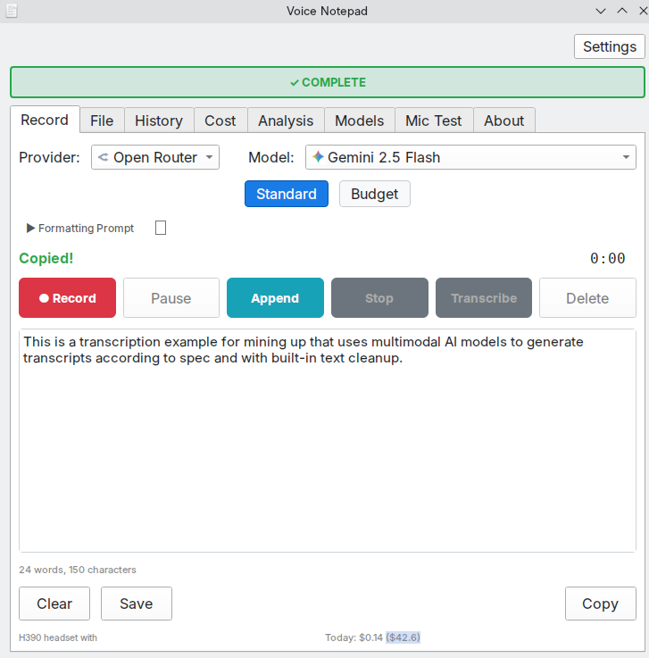

# Voice Notepad

A desktop application for voice recording with AI-powered transcription and cleanup. Uses multimodal AI models to transcribe audio and clean it up in a single pass, eliminating the traditional two-step ASR + LLM approach.




**Download:** [GitHub Releases](https://github.com/danielrosehill/Voice-Notepad/releases) (AppImage, Windows Installer, Debian .deb, Tarball)

## How It Works

Most voice-to-text apps use a two-step process: first transcribe with ASR, then clean up with an LLM. Voice Notepad sends your audio directly to multimodal AI models that can hear and transcribe in a single pass.

This matters because the AI "hears" your tone, pauses, and emphasis rather than just processing raw text. Verbal editing works naturally: say "scratch that" or "new paragraph" and the model understands. You also get faster turnaround and lower cost with one API call instead of two.

## Supported Providers

**OpenRouter** (recommended) provides access to multiple models through a single API key with accurate per-key cost tracking. Available models include Gemini 2.5 Flash, GPT-4o Audio Preview, and Voxtral Small.

**Google AI** (direct) offers Gemini Flash Latest, Gemini 2.5 Flash, Gemini 2.5 Flash Lite, and Gemini 2.5 Pro.

**OpenAI** (direct) provides GPT-4o Audio Preview and GPT-4o Mini Audio Preview.

**Mistral AI** (direct) offers Voxtral Small Latest and Voxtral Mini Latest.

## Features

Voice Notepad records audio and sends it directly to multimodal models with a cleanup prompt. No separate ASR step is required. You can record with your microphone or upload audio files (MP3, WAV, OGG, M4A, FLAC).

Global hotkeys let you record from anywhere, even when the app is minimized. Voice Activity Detection strips silence before upload to reduce costs, and Automatic Gain Control normalizes audio levels for consistent results.

All transcriptions are saved to a local SQLite database with full-text search. The Cost tab monitors API spend, with OpenRouter showing actual key-specific costs. The Analysis tab compares model performance and inference times.

Cleanup prompts are customizable with format presets for email, todo lists, meeting notes, blog posts, and documentation. Audio archival saves recordings in Opus format at about 24kbps.

See [docs/](docs/) for detailed documentation.

## Screenshots


## Cost

Multimodal transcription through models like Gemini 2.5 Flash costs roughly one-tenth of a cent per transcription. Real usage data from Voice Notepad shows 114 transcriptions totaling 11,496 words for $0.14 total.

## Installation

Download from [Releases](https://github.com/danielrosehill/Voice-Notepad/releases).

On Linux, choose AppImage (universal), .deb (Debian/Ubuntu), or tarball (portable). On Windows, choose the installer (.exe) or portable .zip.

Windows may show a SmartScreen warning for unsigned software. Click "More info" then "Run anyway" to proceed. Verify downloads with the SHA256 checksums in the release.

To run from source:

```bash
git clone https://github.com/danielrosehill/Voice-Notepad.git
cd Voice-Notepad
./run.sh
```

The script creates a virtual environment and installs dependencies automatically.

### Development Tasks

Quick access to common tasks via `tasks/` scripts:

```bash
./tasks/dev        # Run from source
./tasks/build      # Build packages
./tasks/install    # Install latest .deb
./tasks/release    # Create release build
./tasks/test       # Run tests
./tasks/clean      # Clean artifacts
```

See [tasks/README.md](tasks/README.md) for detailed usage.

## Configuration

Add your API key via Settings in the app, or set environment variables:

```bash
OPENROUTER_API_KEY=your_key  # Recommended
GEMINI_API_KEY=your_key
OPENAI_API_KEY=your_key
MISTRAL_API_KEY=your_key
```

## Quick Start

1. Select your microphone and AI provider
2. Press Record (or Ctrl+R, or your global hotkey)
3. Speak naturally, including instructions like "new paragraph" or "scratch that"
4. Press Stop & Transcribe (Ctrl+Return)
5. Copy or save your cleaned transcript

## Documentation

- [docs/](docs/) - Full documentation
- [User Manual (PDF)](docs/manuals/Voice-Notepad-User-Manual-v1.pdf) - Complete guide
- [changelog.md](changelog.md) - Version history

## Related

- [Audio-Multimodal-AI-Resources](https://github.com/danielrosehill/Audio-Multimodal-AI-Resources) - Curated list of audio-capable multimodal AI models
- [Audio-Understanding-Test-Prompts](https://github.com/danielrosehill/Audio-Understanding-Test-Prompts) - Test prompts for evaluating audio understanding

## License

MIT
