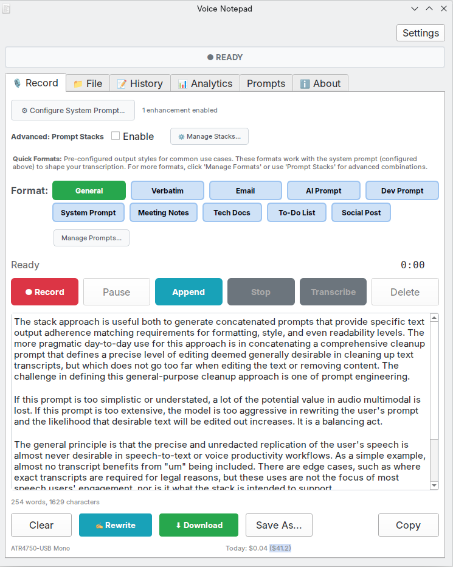
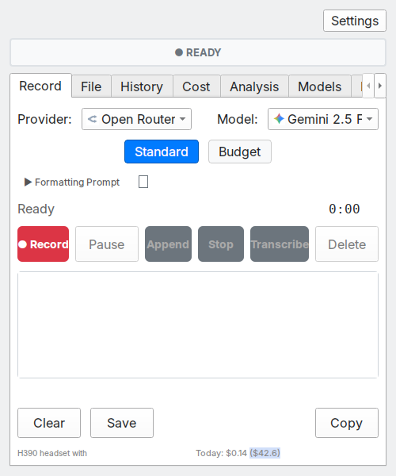
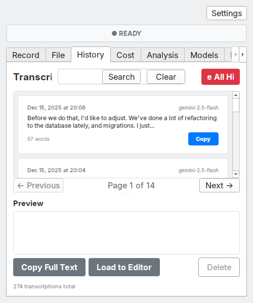

# Voice Notepad - AI Multimodal Based Text Transcription/Dictaiton App (Linux Desktop)




**Download:** [GitHub Releases](https://github.com/danielrosehill/Voice-Notepad/releases) (AppImage, Windows Installer, Debian .deb, Tarball)

This voice notepad app is a consolidation of various prototypes I've been working on this past year.

It uses Gemini multimodal for transcription, supporting both a basic cleanup mode for applying a carefully selected list of basic text remediation instructions, as well as user-defined modes with presets for common formats and personalization support for injecting personalized elements like name and signature into email bodies.

Audio multimodal provides a compelling and often overlooked alternative to ASR and LLM based voice transcription, in my opinion. I periodically share my actual cost metrics from the app to demonstrate just how cost-effective it is (I'm using Gemini 2.5 via Open Router API).


## How It Works

Most voice-to-text apps use a two-step process: first transcribe with ASR, then clean up with an LLM. Voice Notepad sends your audio directly to multimodal AI models that can hear and transcribe in a single pass.

This matters because the AI "hears" your tone, pauses, and emphasis rather than just processing raw text. Verbal editing works naturally: say "scratch that" or "new paragraph" and the model understands. You also get faster turnaround and lower cost with one API call instead of two.

## Supported Providers

**OpenRouter** (recommended) provides access to multiple models through a single API key with accurate per-key cost tracking. Available models include Gemini 2.5 Flash, GPT-4o Audio Preview, and Voxtral Small.

**Google AI** (direct) offers Gemini Flash Latest, Gemini 2.5 Flash, Gemini 2.5 Flash Lite, and Gemini 2.5 Pro.

**OpenAI** (direct) provides GPT-4o Audio Preview and GPT-4o Mini Audio Preview.

**Mistral AI** (direct) offers Voxtral Small Latest and Voxtral Mini Latest.

## Features

Voice Notepad records audio and sends it directly to multimodal models with a cleanup prompt. No separate ASR step is required. You can record with your microphone or upload audio files (MP3, WAV, OGG, M4A, FLAC).

Global hotkeys let you record from anywhere, even when the app is minimized. Voice Activity Detection strips silence before upload to reduce costs, and Automatic Gain Control normalizes audio levels for consistent results.

### Database & Storage

All transcriptions are saved to a **MongoDB-compatible database** (using Mongita, a pure Python MongoDB implementation). This provides flexible document storage with full-text search capabilities. Data is stored locally at `~/.config/voice-notepad-v3/mongita/`.

The Cost tab monitors API spend, with OpenRouter showing actual key-specific costs. The Analysis tab compares model performance and inference times.

### Prompt Management

**Prompt Stacks** let you layer multiple AI instructions for complex transcription scenarios. Create and save reusable prompt combinations that stack together with the base cleanup prompt. Perfect for specialized workflows like meeting notes with action items, technical documentation with code extraction, or multi-language transcription with translation.

Cleanup prompts are customizable with format presets for email, todo lists, meeting notes, blog posts, and documentation. Audio archival saves recordings in Opus format at about 24kbps.

**Email Personalization** allows you to configure separate business and personal email addresses with custom signatures (Settings → Personalization). When generating emails, the app automatically injects the appropriate signature via prompt injection, eliminating manual signature entry and ensuring consistent professional formatting.

See [docs/](docs/) for detailed documentation.

## Screenshots





## Cost

Multimodal transcription is extraordinarily cost-effective. Real usage data from Voice Notepad using Gemini 2.5 Flash:

- **848 transcriptions** for **$1.17 total**
- **84,000 words** transcribed and cleaned
- About **$0.014 per 1,000 words** (1.4 cents)

This includes the full cleanup prompt that handles formatting, punctuation, filler word removal, and more.


## Installation

Download from [Releases](https://github.com/danielrosehill/Voice-Notepad/releases).

On Linux, choose AppImage (universal), .deb (Debian/Ubuntu), or tarball (portable). On Windows, choose the installer (.exe) or portable .zip.

Windows may show a SmartScreen warning for unsigned software. Click "More info" then "Run anyway" to proceed. Verify downloads with the SHA256 checksums in the release.

To run from source:

```bash
git clone https://github.com/danielrosehill/Voice-Notepad.git
cd Voice-Notepad
./run.sh
```

The script creates a virtual environment using `uv` (fast Python package manager) and installs dependencies automatically.

**Note:** Requires `uv` to be installed. Install with:
```bash
curl -LsSf https://astral.sh/uv/install.sh | sh
```

### Development

Run from source:

```bash
./run.sh           # Run from source without installing
```

Build and install locally:

```bash
./build.sh --dev   # Fast build + install (no compression)
```

Create a release:

```bash
./build.sh --release        # Bump version + build all formats
./build.sh --release-deb    # Bump version + build .deb only
```

Run `./build.sh` with no arguments to see all available commands.

## Configuration

Add your API key via Settings in the app, or set environment variables:

```bash
OPENROUTER_API_KEY=your_key  # Recommended
GEMINI_API_KEY=your_key
OPENAI_API_KEY=your_key
MISTRAL_API_KEY=your_key
```

## Quick Start

1. Select your microphone and AI provider
2. Press Record (or Ctrl+R, or your global hotkey)
3. Speak naturally, including instructions like "new paragraph" or "scratch that"
4. Press Stop & Transcribe (Ctrl+Return)
5. Copy or save your cleaned transcript

## Documentation

- [docs/](docs/) - Full documentation
- [User Manual (PDF)](docs/manuals/Voice-Notepad-User-Manual-v1.pdf) - Complete guide
- [changelog.md](changelog.md) - Version history

## Related

- [Audio-Multimodal-AI-Resources](https://github.com/danielrosehill/Audio-Multimodal-AI-Resources) - Curated list of audio-capable multimodal AI models
- [Audio-Understanding-Test-Prompts](https://github.com/danielrosehill/Audio-Understanding-Test-Prompts) - Test prompts for evaluating audio understanding

## License

MIT
