<div align="center">

# Voice Notepad

**Multimodal Cloud Transcription for Desktop**

[](LICENSE)
[](https://github.com/danielrosehill/Voice-Notepad/releases)
[](https://python.org)

<br/>

[**Download**](https://github.com/danielrosehill/Voice-Notepad/releases) · [**User Manual (PDF)**](docs/documentation/manuals/Voice-Notepad-User-Manual-v3.pdf) · [**Documentation**](docs/)

<br/>


</div>

---

## Why Voice Notepad?

Most transcription apps use a **two-step process**: ASR transcription followed by LLM cleanup. Voice Notepad sends audio directly to **multimodal AI models** that transcribe and format in a single pass.

| Traditional Approach | Voice Notepad |
|---------------------|---------------|
| Record → ASR → Raw text → LLM → Formatted output | Record → Multimodal AI → Formatted output |
| Two API calls, higher latency | **Single API call, faster results** |
| AI reads text only | **AI "hears" your voice** |

The AI hears tone, pauses, and emphasis. Verbal commands like *"scratch that"* or *"new paragraph"* work naturally.

---

## Key Benefits

- **Cost-effective** — 848 transcriptions for $1.17 (~1.4¢ per 1,000 words)
- **Fast** — Single API call with local preprocessing
- **Smart cleanup** — Removes filler words, adds punctuation, formats output
- **Global hotkeys** — Record from anywhere, even when minimized
- **Flexible output** — App window, clipboard, or inject directly at cursor

---

## Documentation

<table>
<tr>
<td width="80" align="center">
<a href="docs/documentation/manuals/Voice-Notepad-User-Manual-v3.pdf">

</a>
</td>
<td>
<strong><a href="docs/documentation/manuals/Voice-Notepad-User-Manual-v3.pdf">User Manual v3 (PDF)</a></strong><br/>
Complete 27-page guide covering installation, configuration, hotkey setup, and troubleshooting.
</td>
</tr>
<tr>
<td align="center">
<a href="docs/">

</a>
</td>
<td>
<strong><a href="docs/">Online Documentation</a></strong><br/>
Markdown docs for installation, audio pipeline, cost tracking, and technical reference.
</td>
</tr>
</table>

---

## Quick Start

1. **Download** from [Releases](https://github.com/danielrosehill/Voice-Notepad/releases) (AppImage, .deb, or Windows installer)
2. **Add your API key** (Google Gemini or OpenRouter)
3. **Press Record**, speak naturally, **press Transcribe**
4. Get clean, formatted text

```bash
# Or run from source
git clone https://github.com/danielrosehill/Voice-Notepad.git
cd Voice-Notepad && ./run.sh
```

---

## Dual-Pipeline Architecture

Voice Notepad combines **local preprocessing** with **cloud transcription** for optimal cost and quality.

```mermaid
flowchart LR
    subgraph LOCAL["🖥️ Local Preprocessing"]
        direction LR
        A[🎤 Record<br/>48kHz] --> B[📊 AGC<br/>Normalize]
        B --> C[🔇 VAD<br/>Remove Silence]
        C --> D[📦 Compress<br/>16kHz mono]
    end

    subgraph CLOUD["☁️ Cloud Transcription"]
        direction LR
        E[📝 Prompt<br/>Concatenation] --> F[🤖 Gemini API<br/>Audio + Prompt]
        F --> G[✨ Formatted<br/>Text]
    end

    D --> E

    style LOCAL fill:#e8f5e9,stroke:#4caf50,stroke-width:2px
    style CLOUD fill:#e3f2fd,stroke:#2196f3,stroke-width:2px
```



| Stage | Component | Purpose |
|-------|-----------|---------|
| Local | **AGC** | Normalizes audio levels (target -3 dBFS) |
| Local | **VAD** | Strips silence — typically 30-80% reduction |
| Local | **Compress** | Downsamples to 16kHz mono WAV |
| Cloud | **Prompt Concatenation** | Builds layered instructions |
| Cloud | **Gemini API** | Single-pass transcription + cleanup |

---

## Prompt Concatenation System

Voice Notepad uses a **layered prompt architecture** where instructions are concatenated at transcription time. This allows flexible, modular control over output formatting.

```mermaid
flowchart TB
    subgraph FOUNDATION["🏗️ Foundation Layer (Always Applied)"]
        F1[Remove filler words]
        F2[Add punctuation]
        F3[Fix grammar & spelling]
        F4[Honor verbal commands]
        F5[Handle background audio]
    end

    subgraph FORMAT["📋 Format Layer"]
        FMT[Email / Todo / Meeting Notes<br/>Blog / Documentation / AI Prompt]
    end

    subgraph STYLE["🎨 Style Layer"]
        S1[Formality<br/>Casual → Professional]
        S2[Verbosity<br/>None → Maximum reduction]
    end

    subgraph PERSONAL["👤 Personalization"]
        P1[Email signatures]
        P2[User name]
    end

    FOUNDATION --> FORMAT
    FORMAT --> STYLE
    STYLE --> PERSONAL
    PERSONAL --> OUTPUT[📤 Final Prompt]

    style FOUNDATION fill:#fff3e0,stroke:#ff9800,stroke-width:2px
    style FORMAT fill:#f3e5f5,stroke:#9c27b0,stroke-width:2px
    style STYLE fill:#e8f5e9,stroke:#4caf50,stroke-width:2px
    style PERSONAL fill:#e3f2fd,stroke:#2196f3,stroke-width:2px
```



### Prompt Stacks

**Prompt Stacks** let you save and combine multiple prompt layers for recurring workflows:

| Stack Example | Layers Combined |
|---------------|-----------------|
| **Meeting Notes + Actions** | Foundation + Meeting format + Action item extraction |
| **Technical Documentation** | Foundation + Doc format + Code extraction + Markdown |
| **Quick Email** | Foundation + Email format + Professional tone + Signature |

Create custom stacks in the **Prompt Stacks** tab, then apply them with a single click.

---

## Supported Providers

| Provider | Recommended Model | Notes |
|----------|-------------------|-------|
| **Google Gemini** | `gemini-flash-latest` | Direct API, auto-updates to latest Flash model |
| **OpenRouter** | `google/gemini-2.5-flash` | Per-key cost tracking, OpenAI-compatible API |

---

## Screenshots

<details>
<summary><strong>Click to expand screenshots</strong></summary>

### Main Interface


### Analytics Dashboard


### Global Hotkeys


### Prompt Formats


</details>

---

## Technology Stack

| Component | Technology |
|-----------|------------|
| Transcription | Google Gemini / OpenRouter |
| Voice Activity Detection | [TEN VAD](https://github.com/TEN-framework/ten-vad) |
| Text-to-Speech | [Edge TTS](https://github.com/rany2/edge-tts) |
| Database | [Mongita](https://github.com/scottrogowski/mongita) |
| UI Framework | PyQt6 |

See [Technology Stack](docs/documentation/stack.md) for details.

---

## Benchmark Data

Real usage from ~2,000 transcriptions shows OpenRouter's Gemini 2.5 Flash delivers **2x faster inference**:

| Provider | Model | Avg Inference | Chars/sec |
|----------|-------|---------------|-----------|
| Gemini Direct | gemini-flash-latest | 5.1s | 90 |
| OpenRouter | google/gemini-2.5-flash | 2.5s | 204 |

Anonymized usage data available in [data/](data/).

---

## AI-Human Co-Authorship

This software was developed through AI-human collaboration. Code was generated by **Claude Opus 4.5** under my direction—I designed the architecture and specified requirements while Claude wrote the implementation.

---

## Related Projects

- [Audio-Multimodal-AI-Resources](https://github.com/danielrosehill/Audio-Multimodal-AI-Resources) — Curated list of audio-capable multimodal models
- [Audio-Understanding-Test-Prompts](https://github.com/danielrosehill/Audio-Understanding-Test-Prompts) — Test prompts for evaluating audio understanding

---

## License

MIT
