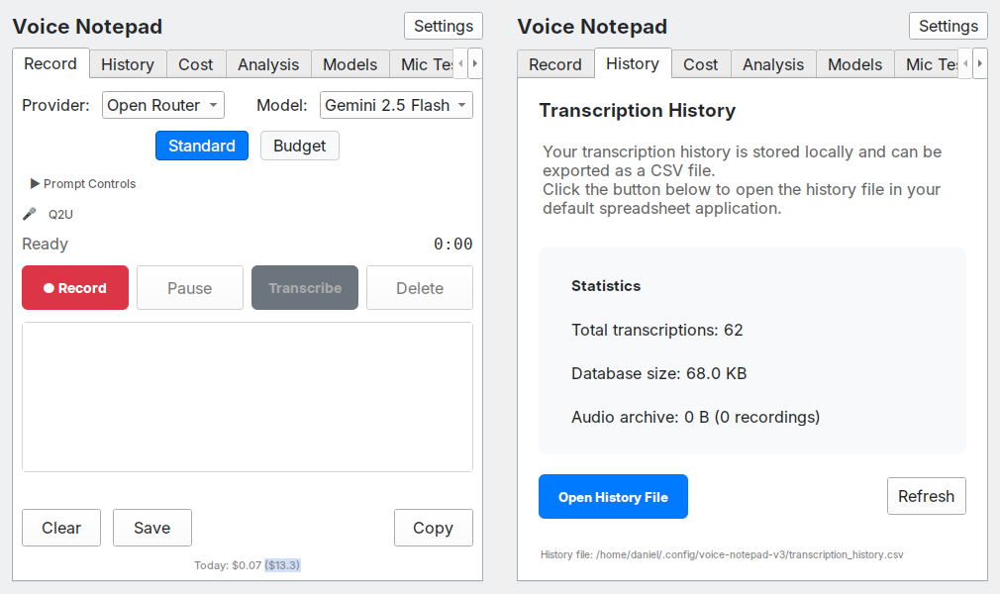
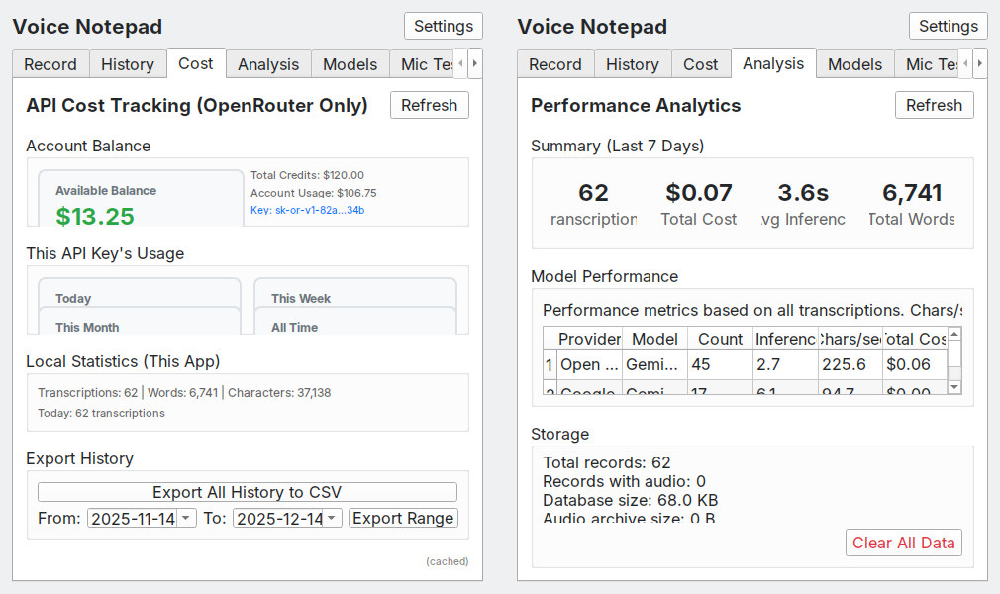
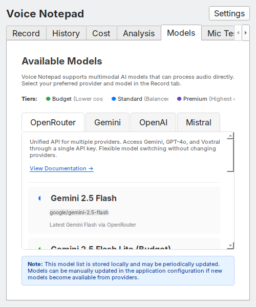
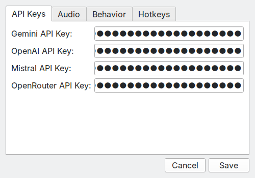
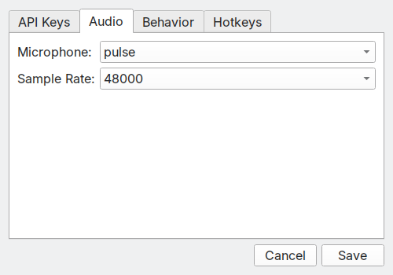
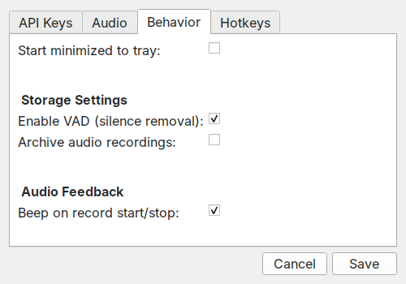
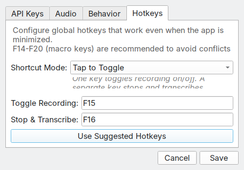

# Screenshots

Screenshots from version 1.3.0.

## Overview

## Main Tabs

**Record Tab** - Main interface for recording and transcription.

**History Tab** - Browse and search past transcriptions.

**Cost Tab** - Track API spending.

**Analysis Tab** - Performance metrics and model statistics.

**Models Tab** - Available AI models by provider.

**Mic Test Tab** - Test and configure microphone input.

**About Tab** - App information and keyboard shortcuts.

## Settings

