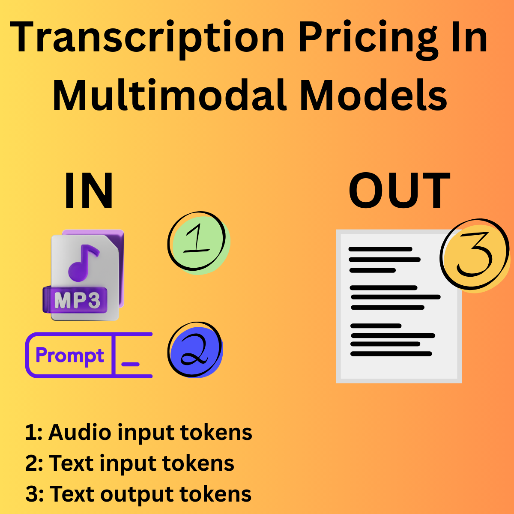
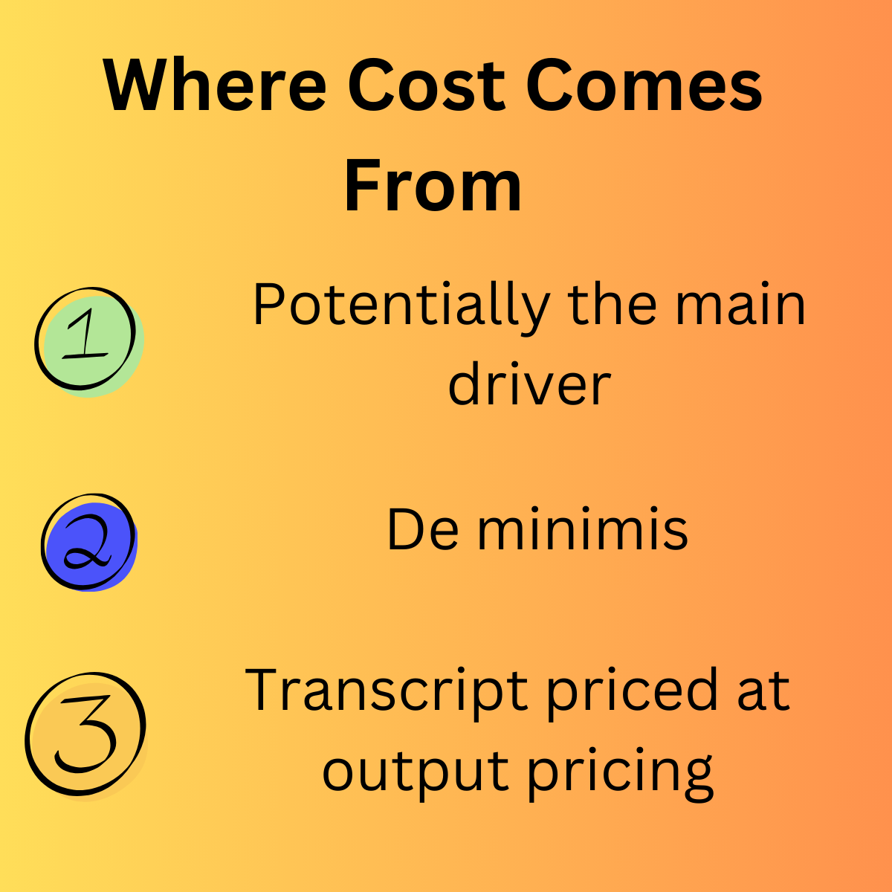
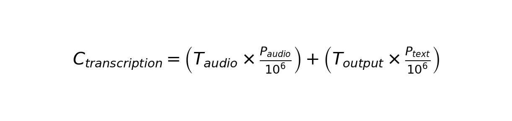

# Pricing For Audio Multimodel Models - Guided Transcription Use-Case

## Inputs

Audio for transcription - most tokens

Guidance prompt - negligible text addition (de minimis)

## Outputs

Text  tokens

## Formula

$$
C_{transcription} = \left( T_{audio} \times \frac{P_{audio}}{10^6} \right) + \left( T_{output} \times \frac{P_{text}}{10^6} \right)
$$

Where:
- $C_{transcription}$ = Total cost per transcription
- $T_{audio}$ = Number of audio input tokens
- $P_{audio}$ = Price per million audio input tokens
- $T_{output}$ = Number of output text tokens
- $P_{text}$ = Price per million output text tokens

**Note:** The guidance prompt contributes negligible tokens (de minimis) and is excluded from the calculation.